# NDIZIAI Mermaid Diagrams Pack

This file contains ready-to-use Mermaid diagram code blocks for project documentation.

## 1. System Context Diagram

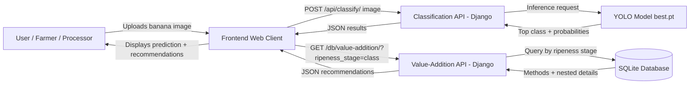

## 2. High-Level Architecture Diagram

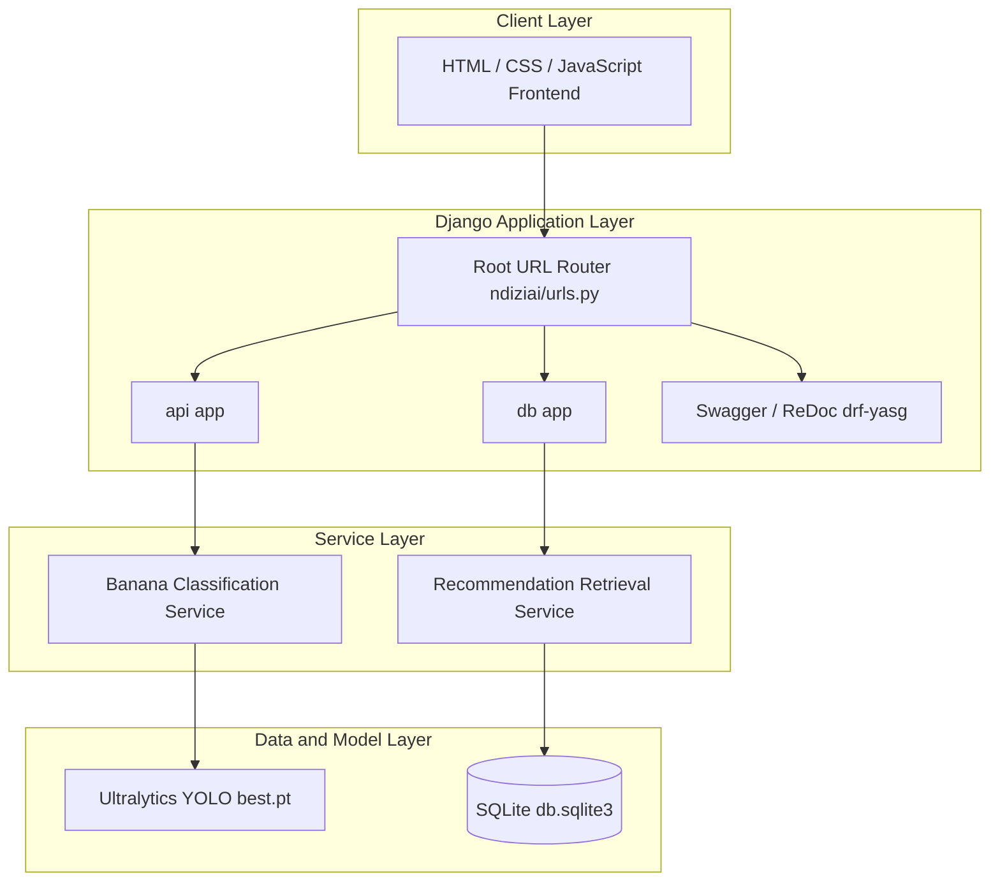

## 3. Component Diagram (Backend)

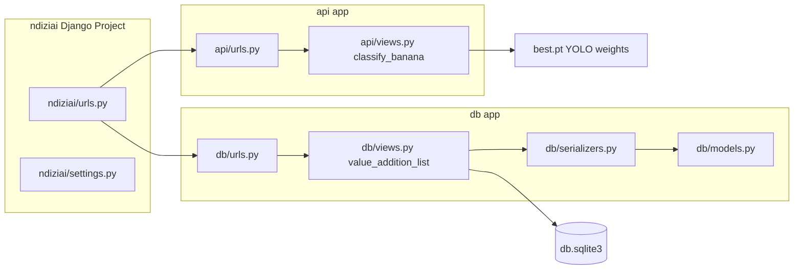

## 4. End-to-End Sequence Diagram

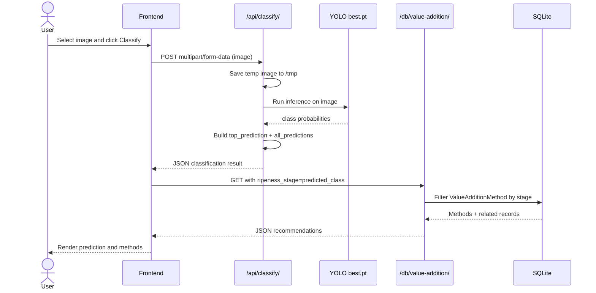

## 5. Classification Flowchart

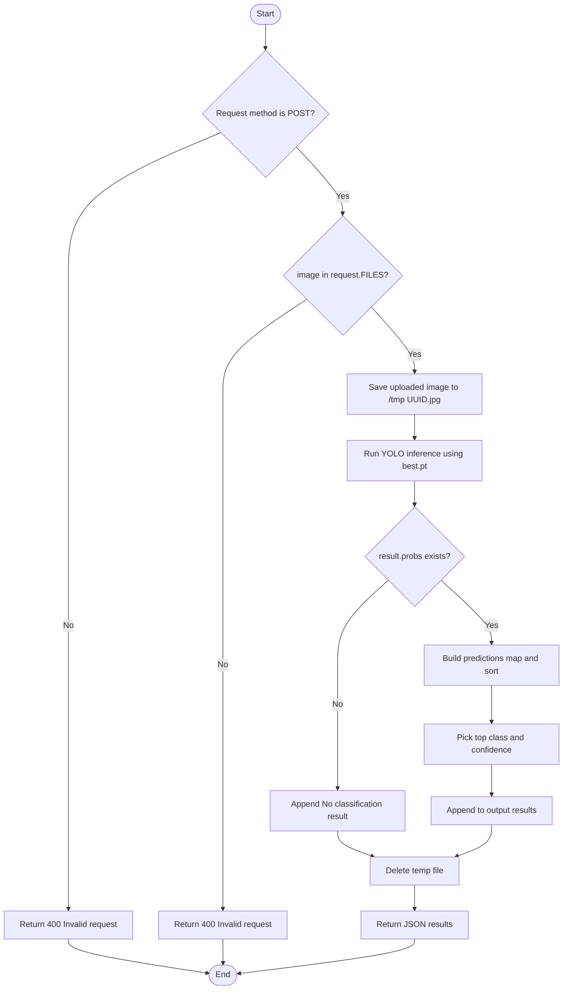

## 6. Recommendation Retrieval Flowchart

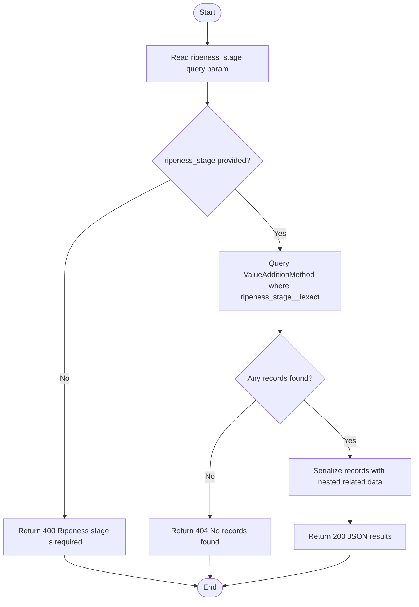

## 7. Data Flow Diagram (DFD Level 0)

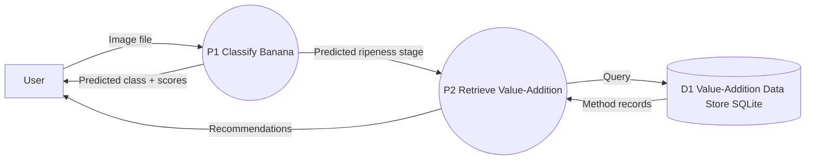

## 8. Entity Relationship Diagram (ERD)

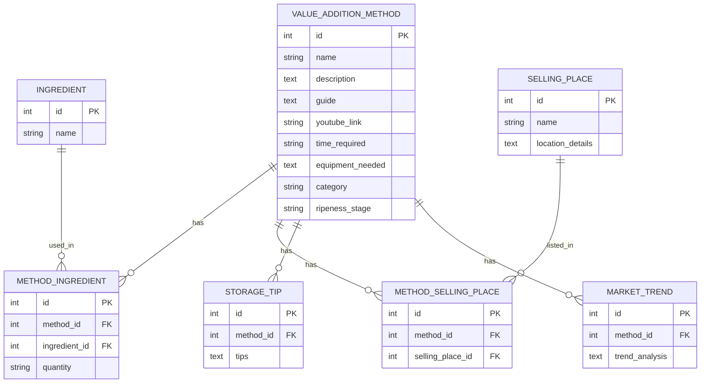

## 9. Class Diagram (Code-Oriented)

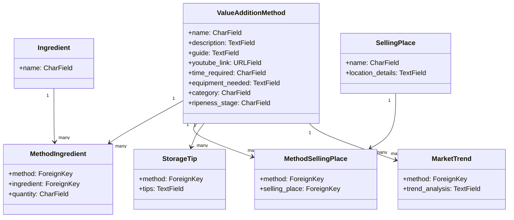

## 10. Use Case Diagram

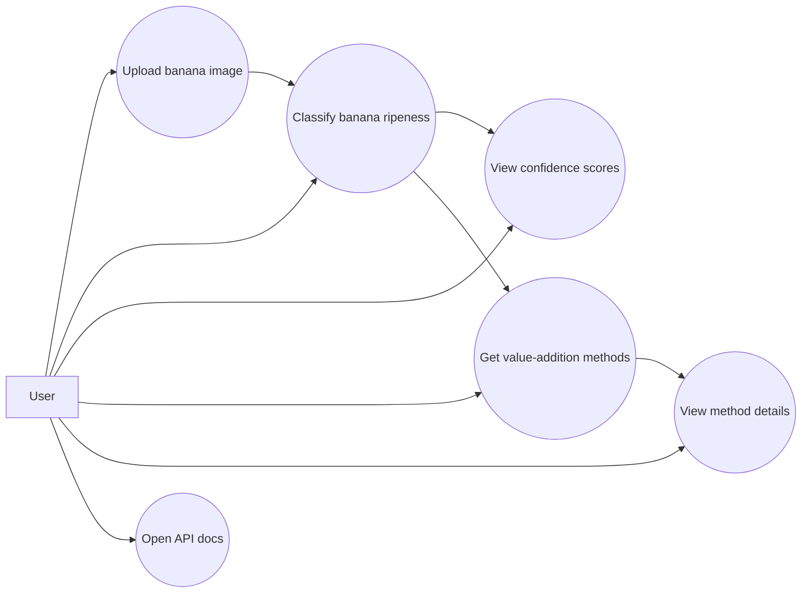

## 11. Deployment Diagram (Development)

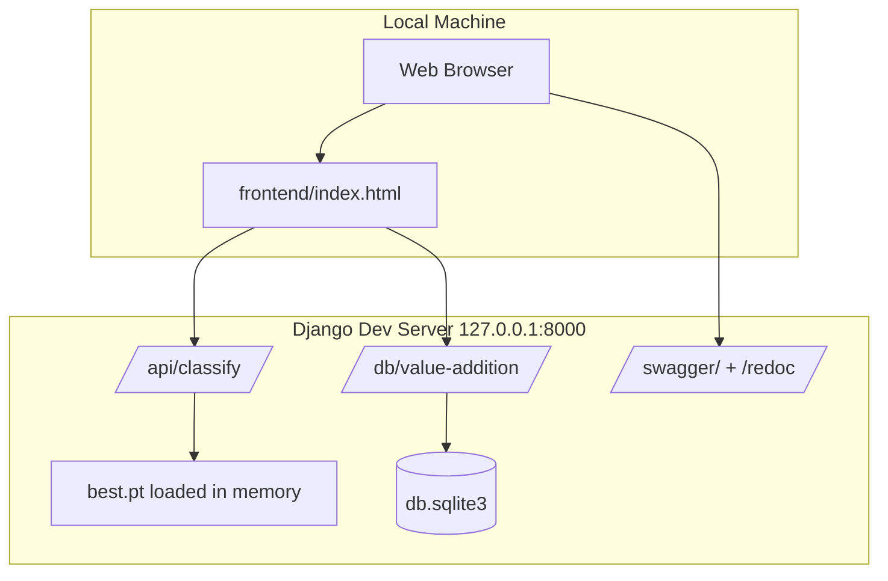

## 12. State Diagram (Ripeness Output States)

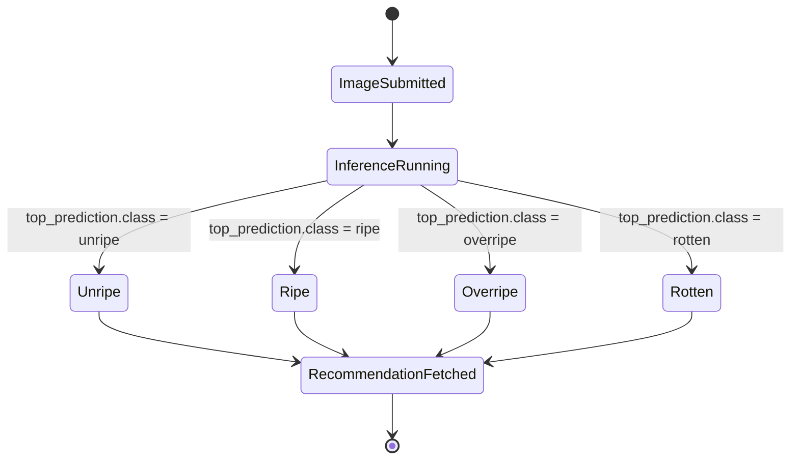

## 13. API Decision Tree (Error Handling)

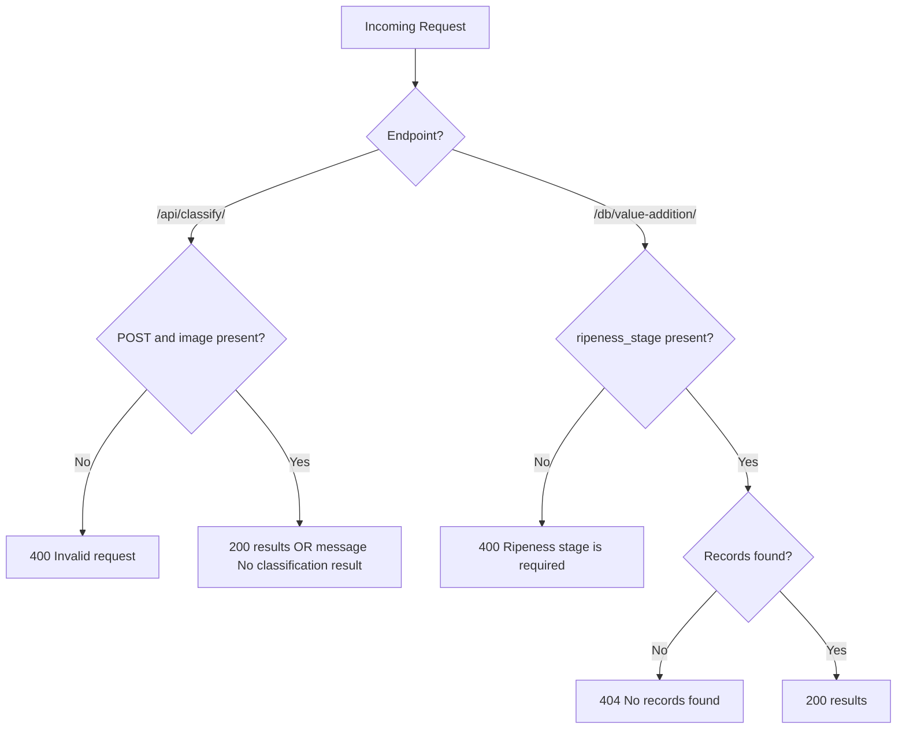

## 14. Documentation Tip

You can copy any block into Markdown docs. For Word:
1. Keep the code block as-is in a fenced block for source appendix.
2. Render diagrams in any Mermaid-compatible tool and export PNG/SVG for the main report.
